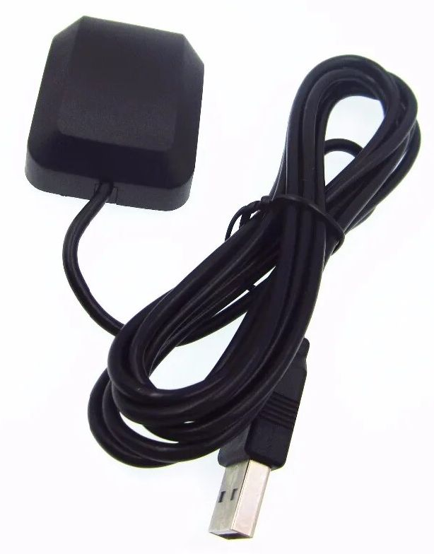

# Reinventing the wheel but with a Raspberry Pi
Why buy a perfectly round wheel when you can build your own clunky one?

## Background
For new car drivers, many insurance companies require installing a smart phone
app which records speed and position.  This is so the insurer can monitor how
safely the new driver is performing (or not).  There are also various apps
which do similar things.  Some of the apps also connect to the car's
OBD (On Board Diagnostics) via a bluetooth adaptor to also record various 
vehicle parameters eg road speed, engine speed, selected gear, etc

## Solution
Raspberry Pis are readily available. USB GPS receivers are available. 
Buetooth OBD receivers are available. What about if we put all of these 
together in a nice, black, plastic box? What's the worst that could happen?

## Hardware
* Raspberry Pi Zero 2 W
* ELM327 based bluetooth OBD connector

  <details>
    <summary>Images</summary>
  
  <p>
  
  </details>

* USB GPS device

  <details>
    <summary>Images</summary>

  <p>

  </details>

### Optional
*  ECU/OBD simulator

    <details>
      <summary>Images</summary>
  
    <p>
    <p>
    <p>
    <p>
  
    </details>

## Software
* git 2.13+
* .NET 8 SDK

### Optional
* [ELM327 simulator](https://github.com/Ircama/ELM327-emulator)
* [PyGPSClient](https://github.com/semuconsulting/PyGPSClient)

    <details>

  ```bash
  sudo apt install python3-pip python3-tk python3-pil python3-pil.imagetk libjpeg-dev zlib1g-dev
  python3 -m pip install --upgrade pygpsclient
  ```

    </details>

* [Minicom](https://www.makeuseof.com/connect-to-serial-consoles-on-linux/)

## Getting started

```bash
# clone repository
git clone --recurse-submodules https://github.com/TrevorDArcyEvans/TrackerPi.git

# build code
cd TrackerPi/src
dotnet build

# run main app
cd TrackerPi/bin/Debug/net8.0/
./TrackerPi /dev/ttyACM0 /dev/ttyOBD0
```

## Troubleshooting

### [Why would ch341-uart be disconnected from ttyUSB?](https://stackoverflow.com/questions/70123431/why-would-ch341-uart-be-disconnected-from-ttyusb)

When connecting USB OBD device, `dmesg` gives output similar to:

```bash
[679413.370685] usb 1-2.4.3: USB disconnect, device number 10
[679417.176663] usb 1-2.4.3: new full-speed USB device number 11 using xhci_hcd
[679417.298905] usb 1-2.4.3: New USB device found, idVendor=1a86, idProduct=7523, bcdDevice= 2.64
[679417.298915] usb 1-2.4.3: New USB device strings: Mfr=0, Product=2, SerialNumber=0
[679417.298919] usb 1-2.4.3: Product: USB Serial
[679417.337967] ch341 1-2.4.3:1.0: ch341-uart converter detected
[679417.352141] usb 1-2.4.3: ch341-uart converter now attached to ttyUSB0
[679417.890411] input: BRLTTY 6.4 Linux Screen Driver Keyboard as /devices/virtual/input/input16
[679417.895881] usb 1-2.4.3: usbfs: interface 0 claimed by ch341 while 'brltty' sets config #1
[679417.899018] ch341-uart ttyUSB0: ch341-uart converter now disconnected from ttyUSB0
[679417.899038] ch341 1-2.4.3:1.0: device disconnected
```

The device should be connected to `ttyUSB0` but has been disconnected.  Per the referenced article:

```text
For Ubuntu 22.04 (Jammy Jellyfish), the simplest solution is to remove the package brltty via 
`sudo apt remove brltty`, since it''s unnecessary unless you''re using a braille e-reader.  
However, I am unsure if it could cause errors later on.
```

## Acknowledgments
* OBD
  * [Get OBD2 Data via ELM327 C#.NET](https://burak.alakus.net/en/2011/07/27/to-get-obd2-data-via-elm327-c/) 
  * [OBD2NET](https://github.com/0x8DEADF00D/obd2NET)
  * [OBD-II PIDs](https://en.wikipedia.org/wiki/OBD-II_PIDs)
* GPS
  * [Linux support for GPS Receiver over serial port](https://sandervandevelde.wordpress.com/2019/08/21/linux-support-for-gps-receiver-over-serial-port/)
  * [NMEA Parser](https://github.com/sandervandevelde/nmeaparser)
* Other
  * [Circular Buffer](https://github.com/joaoportela/CircularBuffer-CSharp)